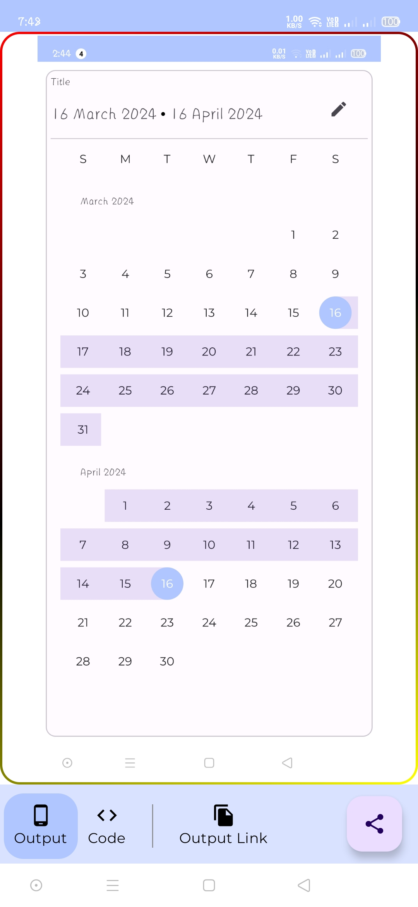

## M3 Compose
Material 3, Component in Jetpack Compose

## Purpose
- I tend to forget code after a period of inactivity.
- I like to access and understand my code from anywhere.
- I prefer to understand code logic after seeing the output first.
- I want to minimize time spent reading and visualizing code outputs

## [View on Playstore](https://play.google.com/store/apps/details?id=com.codexdroid.m3compose)

# Version
- This is the Beginner Version
- More add-ons will be updated in the future

# Screenshots
<table style="width:100%">
  <tr>
    <td></td>
    <td></td>
    <td></td>
    <td></td>
  </tr>
</table>

# Liked & Useful? ❤️
- Hit ⭐ by showing support,

# License

```markdown
Copyright 2024 Akshay Pawar

Licensed under the Apache License, Version 2.0 (the "License");
you may not use this file except in compliance with the License.
You may obtain a copy of the License at

    http://www.apache.org/licenses/LICENSE-2.0

Unless required by applicable law or agreed to in writing, software
distributed under the License is distributed on an "AS IS" BASIS,
WITHOUT WARRANTIES OR CONDITIONS OF ANY KIND, either express or implied.
See the License for the specific language governing permissions and
limitations under the License.
```

 

 

 


